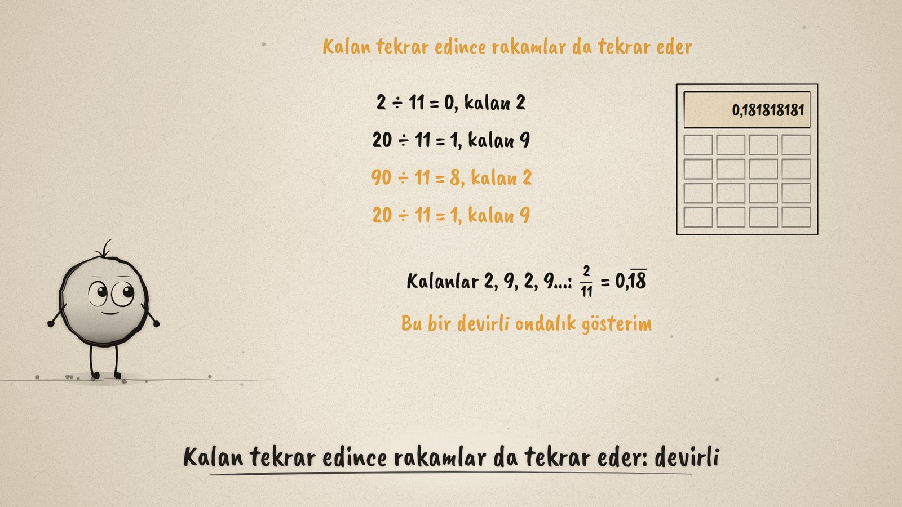
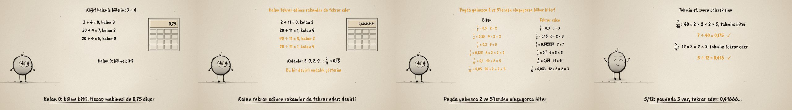

# Biter mi, Tekrar mı Eder? · Fractions as Division

**▶ Tarayıcıda izleyin / Watch in the browser:** https://hakanatas.github.io/biter-mi-tekrar-mi/ 
**⬇ MP4 + altyazılar / MP4 + subtitles:** [Releases](https://github.com/hakanatas/biter-mi-tekrar-mi/releases) 
**✎ Kullanılan istem / The prompt behind it:** [PROMPT.md](PROMPT.md) 
**🎞 Bütün filmler / All films:** [Nokta'nın Filmleri](https://hakanatas.github.io/nokta-filmleri/?sinif=6)

> **TR —** 6. sınıf matematik "Sayılar ve Nicelikler" temasındaki MAT.6.1.6 öğrenme çıktısı için hazırlanmış, tamamen JavaScript ile çizilen 92 saniyelik mürekkep animasyonu. Kesir çizgisi bir bölme işaretidir: 3/4 = 3 ÷ 4. Bölmeler kâğıt kalemle adım adım yapılıyor ve hesap makinesiyle kontrol ediliyor. 3 ÷ 4'te kalan 0 oluyor, bölme bitiyor: 0,75. 1 ÷ 3'te kalan hep 1, 2 ÷ 11'de kalanlar 2, 9, 2, 9: kalan tekrar edince rakamlar da tekrar ediyor (devirli ondalık gösterim, tekrar eden kısmın üstünde çizgi). Birim kesirlerden bir tablo kuruluyor; paydalar asal çarpanlarına ayrılınca örüntü görünüyor ve genelleniyor: sadeleşmiş kesrin paydası yalnızca 2 ve 5'lerden oluşuyorsa ondalık gösterim biter. Kural 7/40 ve 5/12 ile önce tahmin edilip sonra bölünerek sınanıyor. Altyazılar Türkçe, İngilizce ya da ikisi birlikte seçilebilir.

A 92-second ink animation for **6th-grade maths**, drawn entirely with JavaScript on an HTML5 canvas. Nokta, the ink character from [The Learning Ink](https://github.com/hakanatas/the-learning-ink), is the guide again. Nothing in the divisions is typed by hand: the step rows come from `steps`, and every decimal with its repeating block (and the bar over it) comes from `dec`, both in `src/draw/film.js`.

## Learning outcome

MEB, Türkiye Yüzyılı Maarif Modeli, Ortaokul Matematik, 6th grade, "Sayılar ve Nicelikler" theme:

**MAT.6.1.6. Kesir ve bölme işlemi arasındaki ilişkiye yönelik tümevarımsal akıl yürütebilme**
- a) Kâğıt-kalemle ve hesap makinesinde bölme işlemi gerçekleştirerek kesirlerin ondalık gösterimlerine ilişkin gözlem yapar.
- b) Kesirlerin sonlu ve devirli ondalık gösterimlerine ait örüntüleri belirler.
- c) Örüntülerde keşfedilen ilişkileri geneller.

## Scenes

| # | Time | Scene | What happens | Outcome |
|---|---|---|---|---|
| 1 | 0–10 s | Kesir bir bölmedir | 3 pizzas for 4 people: 3/4 = 3 ÷ 4. | a |
| 2 | 10–30 s | Kâğıt kalemle | 3 ÷ 4 step by step, remainder 0; the calculator agrees: 0.75, a terminating decimal. | a |
| 3 | 30–50 s | Tekrar eden | 1 ÷ 3 (remainder always 1) and 2 ÷ 11 (remainders 2, 9, 2, 9): repeating decimals with a bar. | a, b |
| 4 | 50–70 s | Örüntü | Unit fractions sorted into "ends" and "repeats"; denominators factorised: only 2s and 5s means it ends. | b, c |
| 5 | 70–80 s | Tahmin et, sına | Predict from the denominator, then divide: 7/40 = 0.175, 5/12 = 0.41666... | c |
| 6 | 80–92 s | Aklında kalsın | A fraction is a division; it ends or repeats; the 2-and-5 rule. | c |

## Running it

- **Preview:** double-click `index.html` (it works offline).
- **MP4:** run `npm install` once, then `npm run export -- --format=horizontal --captions=tr`.
- **Subtitles and narration:** `npm run srt` writes `out/captions_*.srt` and `narration_notes.txt`.
- **Editing:**
  - Caption text, timings and narration notes: `captions.js`
  - Everything on screen is drawn by `LI.world(t)` in `scenes/scene1.js` (the three divisions in `PHASE`, the table lists `LEFT` and `RIGHT`, the predictions); the other scenes only set the camera.
  - Fractions and decimals with a bar (`expr`, `dec`), division steps, the calculator and Nokta's poses: `src/draw/film.js`; layout for 16:9 and 9:16: `src/draw/kd.js`

It uses the same engine as The Learning Ink: `renderFrame(t)` as a pure function of time, seeded randomness, and frame-by-frame export.
